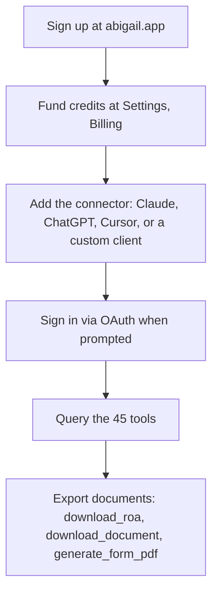
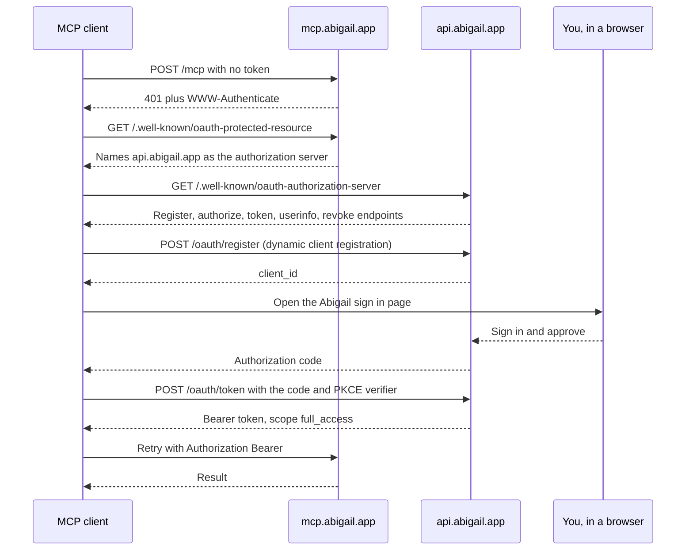

Abigail runs a Model Context Protocol server. Point an MCP capable assistant at
one URL and it gains 45 patent prosecution tools: docket, deadlines, office
action analysis, the guided response wizard, USPTO forms, and agent workflows.

```
https://mcp.abigail.app/mcp
```

## What you get

The same product as abigail.app, reached through your assistant instead of a
browser. The server is a stateless proxy in front of the identical backend the
web app calls, so the account, the docket, the tenant isolation, and the credit
balance are one and the same. A case added through an assistant appears on My
Docket; a draft generated in the web wizard downloads through MCP. There is no
sync step and no second copy of the data.

Every tool result is JSON, which matters if you are not using a chat client at
all. The protocol is the integration surface, so an independent application can
speak MCP directly and parse structured results rather than scraping prose.

## The lifecycle



Sign up and funding happen on the web. Everything after that happens wherever
your assistant lives.

## Signing in

Every tool requires a signed in account. A request that carries no valid Bearer
token is answered with HTTP 401 and a `WWW-Authenticate` header naming the
protected resource metadata document, which is what a compliant client needs to
discover the rest on its own.



Your assistant performs this on your behalf. There is no key to copy, no
pre issued secret, and no onboarding email: the server supports dynamic client
registration, and the only code challenge method is `S256`.

<Warning>
  The MCP server does not accept `abi_sk_` API keys. It uses OAuth 2.1. See
  [Authentication](/authentication) for the comparison.
</Warning>

## Your platform

<CardGroup cols={2}>
  <Card title="Setup, per client" icon="plug" href="/mcp/connect">
    Claude, ChatGPT, Cursor, and custom clients, with the discovery chain
    spelled out step by step.
  </Card>
  <Card title="Match the web app" icon="arrows-left-right" href="/mcp/parity">
    Every Abigail screen reproduced as a tool sequence, plus the known gaps.
  </Card>
  <Card title="Tool reference" icon="wrench" href="/mcp/tools">
    All 45 tools, what each one requires, and the web app feature behind it.
  </Card>
  <Card title="Billing and limits" icon="credit-card" href="/concepts/rate-limits">
    What is deducted, when, and the current rates.
  </Card>
</CardGroup>

In short: **Claude** takes a custom connector URL under Settings, Connectors.
**ChatGPT** adds an MCP server the same way, and reads the tool annotations the
server advertises so it can tell a lookup from a write. **Cursor and other
clients** take a `mcpServers` entry pointing at the URL. **A custom client**
speaks streamable HTTP directly.

## Billing

MCP usage draws on the same credit balance as the web app, priced identically.
AI usage is deducted per token, and document exports carry a fixed fee. Call
`check_credits` at any point to read the balance, and see
[Billing and rate limits](/concepts/rate-limits) for the current rates.

Purchases happen on the web only, at
[abigail.app/settings?tab=billing](https://abigail.app/settings?tab=billing).
Tools that report a balance work normally inside an assistant; topping up does
not.

## For independent developers

The transport is streamable HTTP and the server is stateless, so a single POST
per JSON-RPC message is enough. No session to keep alive, no SSE stream to hold
open.

An unauthenticated call shows the challenge:

```bash
curl -i https://mcp.abigail.app/mcp \
  -H "Content-Type: application/json" \
  -H "Accept: application/json, text/event-stream" \
  -d '{"jsonrpc":"2.0","id":1,"method":"tools/list","params":{}}'
```

```
HTTP/1.1 401 Unauthorized
WWW-Authenticate: Bearer resource_metadata="https://mcp.abigail.app/.well-known/oauth-protected-resource"
```

Follow the chain in the diagram above to a Bearer token, then call a tool:

```bash
curl -s https://mcp.abigail.app/mcp \
  -H "Authorization: Bearer $ABIGAIL_TOKEN" \
  -H "Content-Type: application/json" \
  -H "Accept: application/json, text/event-stream" \
  -d '{"jsonrpc":"2.0","id":2,"method":"tools/call",
       "params":{"name":"get_docket","arguments":{}}}'
```

Every result is JSON. Read only tools are annotated as such in the protocol, so
a client can distinguish a lookup from a write without guessing, and some tools
attach a `next_actions` array naming the tool to call next. Building on those
two signals gives you the guided path the web app offers, without hardcoding a
workflow.
