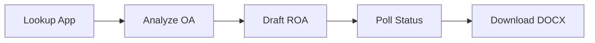

## 1. Create an account

Sign up at [abigail.app](https://abigail.app) using your email or Google account.
Authentication is handled by Clerk.

## 2. Generate an API key

1. Log in at [abigail.app](https://abigail.app)
2. Go to [Settings > API Keys](https://abigail.app/settings?tab=api-keys)
3. Click **Create API Key** and name it (e.g., "OpenClaw Agent")
4. Copy the key immediately -- it is shown only once

Your key looks like: `abi_sk_a1b2c3d4e5f6...` (39 characters).

<Warning>
  Store your API key securely. It cannot be retrieved after creation.
  If lost, revoke the old key and create a new one.
</Warning>

## 3. Make your first call

Try a free endpoint first (no API key needed):

```bash
curl https://api.abigail.app/v1/openclaw/lookup/17200011
```

Then try a paid endpoint with your key:

```bash
curl -X POST https://api.abigail.app/v1/openclaw/analyze \
  -H "X-API-Key: abi_sk_your_key_here" \
  -H "Content-Type: application/json" \
  -d '{
    "application_number": "17200011",
    "office_action_text": "Claims 1-5 are rejected under 35 U.S.C. 102(a)(1)...",
    "office_action_type": "CTNF"
  }'
```

## 4. Full workflow

The typical agent workflow is:



1. **Lookup** the application to get metadata and examiner name
2. **Analyze** the office action text to get claim-by-claim analysis
3. **Draft ROA** using the analysis_id and your strategy selections
4. **Poll** the draft job until status is `complete`
5. **Download** the DOCX via the signed URL

## 5. Error handling

Every error response includes an `agent_suggestion` field with actionable guidance
for AI agents:

```json
{
  "error": true,
  "error_code": "app_not_found",
  "message": "Application 99999999 not found.",
  "agent_suggestion": "Application not found. Verify the number format (17200011 or 17/200,011) and check for typos."
}
```

Your agent should read `agent_suggestion` and act on it automatically.
